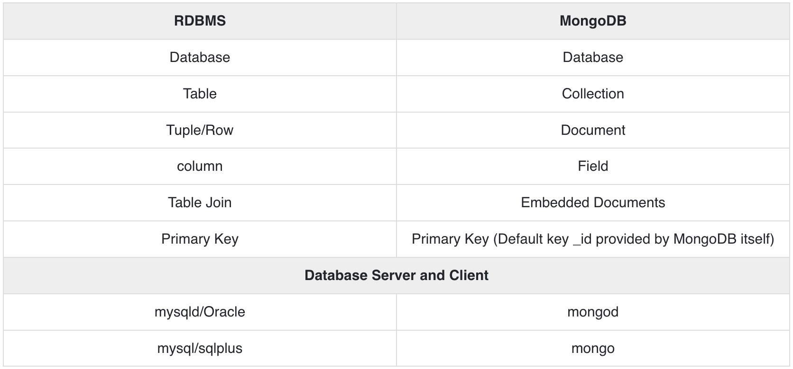

#### Elasticsearch
- NoSQL database
- use Elasticsearch API to get data
- behaves like REST API
  - The difference between POST and PUT is that PUT requests are idempotent. That is, calling the same PUT request multiple times will always produce the same result. In contrast, calling a POST request repeatedly have side effects of creating the same resource multiple times.
    - calling by id will not create new item (PUT)
- fits for ES:
  - Geo queries,
  - Scripted queries
  - Full text queries
  - Shape queries
  - Span queries
  - Term-level queries
  - Specialized queries
  - "More like this" queries

#### Mongodb
- db is a physical container for collections
- each db gets its own set of files in the file system
- single mongodb server has multiple dbs
- collection is a group of mongodb docs
  - equivalent to table in RDBMS
  - no schema
  - all docs in the collection are of similar or related purpose
- Auto-Sharding
- no complex join so better performance
- db model design
  - Embedded
  - Normalized

#### SQL vs Mongodb

#### Sharding in Mongodb
- Normalized model can be stored in different server
- Sharding can be done by range
  - [0,20) - shard A
  - [20, 40) - shard B
  - [40, 50] - shard C
- Sharding can also be done algorithmic (hashed sharding)
- Geography-based sharding or geosharding
- Entity-/relationship-based sharding in RDBMS
