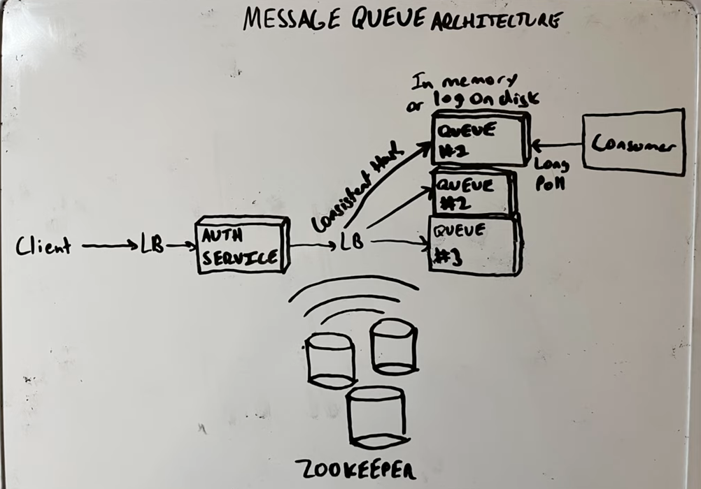

#### References
[System Design: The Distributed Messaging Queue](https://www.educative.io/courses/grokking-modern-system-design-interview-for-engineers-managers/7AVkpYmjlrG)
[System Design — Message Queues](https://medium.com/must-know-computer-science/system-design-message-queues-245612428a22)

#### Terminology
- messaging queue: n intermediate component between the interacting entities known as producers and consumers
- producer: produces messages and places them in the queue
- consumer: retrieves the messages from the queue and processes them
- multiple producers and consumers interacting with the queue at the same time

#### Motivation
- Improved performance: help reduce client-perceived latency
- Better reliability
  - a producer or consumer can fail independently without affecting the others and restart later
  - replicating the messaging queue on multiple servers ensures availability if one or more servers are down
- Granular scalability
  - application is in full control to tweak the number of producer or consumer processes according to its current need
- Priority queue
  - one queue for each priority
  - more service time to a higher priority queue

#### Drawback
- write-read consistency is hard
- need to make sure fault tolerance is in-place, i.e. if fail to process, then queue the message again

#### Useful resource
- [Video1](https://www.youtube.com/watch?v=1vCdeGBoOzw)
- [Video2](https://www.youtube.com/watch?v=e2iK8pUP9Vs)

#### Message broker
- each consumer watch only one queue and the queue is keeping track the last indexed being read
- can be done in memory (redis can be used here): rabbit MQ
  - drawback: can lose the message when the broker is down
- can be done by doing log as well: sequential write to disk is actually quite fast
  - append only logs: more durable

#### Components
- Front end service
  - authentication
  - rate limiting
- Load balancer (can do multiple LBs)
  - consistent hashing
- Zookeeper to watch the cluster and nodes can send heartbeat
- Deliver messages
  - web socket
  - long polling: for video
- Thread safe queue

#### HLD

#### Sample
[Repo](https://github.com/adjust/redismq)

https://levelup.gitconnected.com/eventual-consistency-what-how-and-why-50c942472a0c
how to ensure that a queue not double write? - it is acknowledged and if not acknowledged then queue again