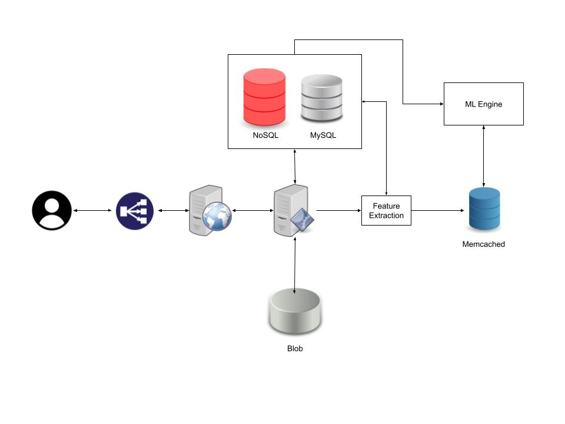

#### Requirements
- Functional
  - user can ask questions and answer
  - user can put image or videos
  - user can upvote or downvote
  - user can search for questions
  - recommendation system
  - ranking system
- Non functional
  - availability
  - scalibility
  - performance
  - consistency

#### Resource Estimation
- Total users: 1 billion
- Active users: 300 million/day
- 15% questions have images - 1 image = 250KBs
- 5% questions have videos - 1 video = 5MBs
- 20 requests/day/user

#### Server
- requests per day = 300M/day * 20 requests/day = 6B requests/day
- requests per sec = 6B requests/day * 1/86400 day/s = 69500 requests/sec
- number of servers = daily active users/requests/sec for each server

#### Storage
- requests per day = 6B
- request with image = 15% * 6B = 900M
- request with video = 5% * 6B = 300M
- storage for image = 900M * 250KB = 225GB/day

#### Bandwidth
- incoming traffic: storage/day * 8bits/86400secs
- outgoing traffic: totalstorage/day * 8bits/86400secs

#### HLD

#### API design
- Post Question
  - Method: POST
  - postQuestion(user_id, question, description, image, video, topic)
- Post Answer
  - Method: POST
  - postAnswer(user_id, question_id, answer, image, video)
- Upvote Answer
  - Method: PUT
  - upvote(user_id, question_id, answer_id)
- Comment
  - Method: POST
  - comment(user_id, answer_id, comment)
- Search
  - Method: GET
  - search(user_id, search_text)