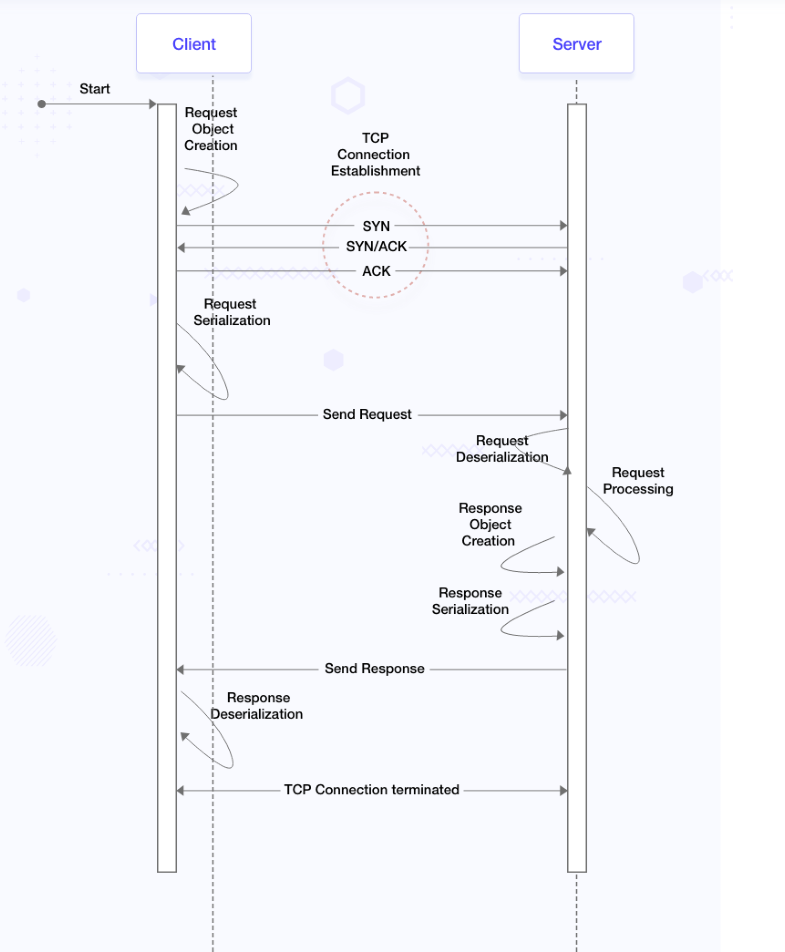
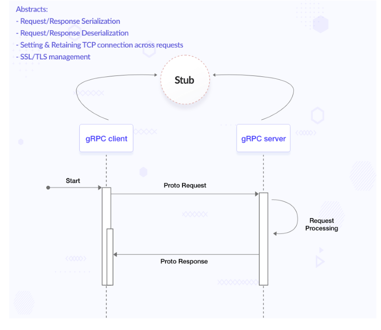

#### RPC
- Remote Procedure Calls
- When a function resides on server, can the client invoke it just by making procedure call?

#### Previous techs
- SOAP: bulky
- REST: trimmed

#### TCP Call Workflow

#### RPC Illustrations
- Request/Response serialization
- Request/Response deserialization
- Setting or retaining TCP conns accross requests
- SSL/TLS management

https://www.infracloud.io/blogs/understanding-grpc-concepts-best-practices/?utm_medium=email&_hsmi=241583943&_hsenc=p2ANqtz-_v4GESSwwHYGSUQgc-BT3Luu03bRvLVhK31XPsQ95tWQYaoCi-gjNwLkldrOTLuMjB_vCRxiMzGaCaL2lkKTLFxufRWw&utm_content=241583943&utm_source=hs_email

- RPC spans the transport layer and the application layer in the Open Systems Interconnection (OSI) model of network communication. RPC makes it easier to develop an application that includes multiple programs distributed in a network.