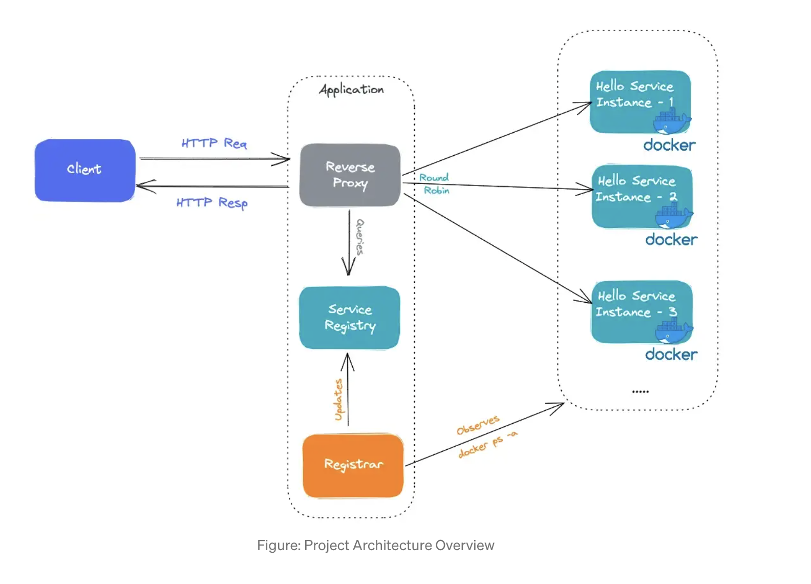

#### Components
- service registry, which is a database of the network locations of an application's service instances.

#### Implementation
- First, the services and their clients interact directly with the service registry.
- The deployment infrastructure (k8s etc.) handles service discovery.

#### HLD
[Link](https://itnext.io/lets-implement-basic-service-discovery-using-go-d91c513883f6)
