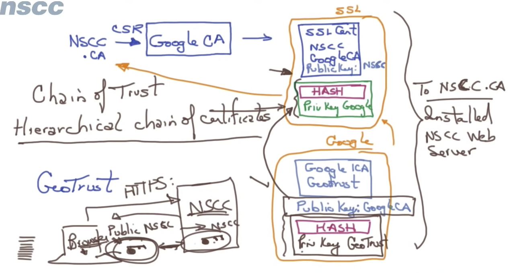

Root CA
- the public key is installed in the browser
- the private key needs to be stored in a secure place => hence intermediate CA

Intermediate CA
- can issue certificate
- but its certificate is signed by root CA

Entity
- CSR: certificate signing request

SSL -> ICA -> CA

#### Workflow
- entity issue CSR and get SSL cert and key from intermediate CA
- an intermediate certificate is sent along that - this cert is signed by the private key of root CA
- browser has root CAs public key
- when browser hits a website, the webserver will send the certificate along
  - browser should know how to decrypt and then get the public key of the entity
  - and then send the request back along when sending the request back to server which has the private key

### Self Signed CA
- when client contacts the server, the server will give the public key
- the client then sends message that is encrypted by the public key
- then the server has the private key to decrypt the message

### Browser
- trust all public CAs and the devices have this information stored

### Steps to generate the self signed
- generate the CA private key
- generate the public certificate using the private CA key 
- openssl to verify
- we then use the CA pem and key to generate SSL
- combine the chain: root CA pem and the intermediate cert pem
- use the cert key and chain into the server
- inject ca.pem into the trusted CA

### Chain of trust
- Server certificate can be signed by root or intermediate CA.
- Chain of trust needs to be presented to establish this the chain when intermediat is presented.
- Trusted CA is only used to establish trust
- Secure connection happens as such that:
  - handshake needs to be established
  - root CA needs to be stored in both parties (client/server) to trust each other
  - once handshake is established then the connection can go through as such that the message will be encrypted by public key and can only be decrypted using the private key

