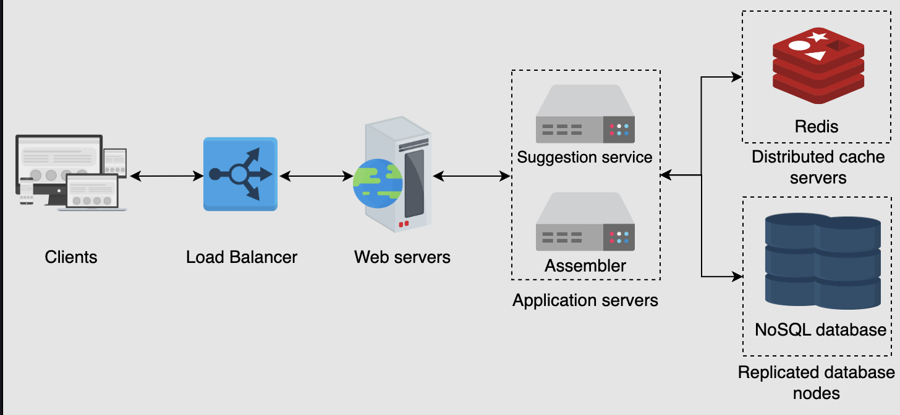

#### Functional requirements
- user is able to type and get some suggestions
- user is able to get most trending searches
- user is able to get most frequent searches

#### Non-functional requirements
- performance: low latency
- high availability
- scalability

#### Resource estimation
- DAU: 3.5billion/8000RPS => get approximate no. of servers
- Storage
  - 2 billion unique queries
  - 15 chars per query
  - 1 char = 2 bytes
  - total = 2 x 15 x 2 = 60GB/day
  - per year = 60GB/day * 365 days/year = 21.9TB/year
- Bandwidth
  - incoming = 3.5billion * 15chars/86400s = 0.607M chars/sec * 2 bytes/char = 1.214M bytes/sec * 8 (1byte=8bits) = 9.7Mb/sec
  - outgoing = 15 chars * 10 suggestions * 9.7Mb/sec = 1.46Gb/sec

#### HLD

- using trie data structure
- mongodb can be useful for storing tries

#### API design
- getSuggestions(prefix)
- addToDatabase(query)

