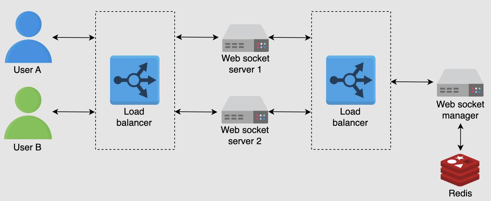

### Questions to ask
- how many users
- what features
  - last seen
  - media
  - encryption
  - phone call

### Functional Requirements
- able to send messages between clients
- last seen online
- able to share images or videos

### Nonfunctional Requirements
- performance
- high availability
- scalability

### Resource estimation
- Daily active users -> Requests per second
- Bandwidth estimation -> Mb/s
- Storage estimation -> GB/TB

### API design
- sendMessage(sender, receiver, type, text=none, object=none, doc=none)
- getMessage(user)
- uploadFile(type, file)
- downloadFile(user, file_id)

### DB
- WA is using Mnesia: RDBMS but using Erlang

### Connection to Web socket
- each online client will be connected to a websocket
- the websocket is provided by many websocket servers
- websocket servers will be managed by websocket managers
- the socket connection info is sent to redis
- and this info will be used by the messaging services

### Why is WebSocket preferred over HTTP(S) protocol for client-server communication?
- HTTP(S) doesn’t keep the connection open for the servers to send frequent data to a client. With HTTP(S) protocol, a client constantly requests updates from the server, commonly called polling, which is resource intensive and causes latency. WebSocket maintains a persistent connection between the client and a server. This protocol transfers data to the client immediately whenever it becomes available. It provides a bidirectional connection used as a common solution to send asynchronous updates from a server to a client.

### Send or Receive Messages

- To minimize the latency and reduce the number of these calls to the WebSocket manager, each WebSocket server caches the following information:
  - If both users are connected to the same server, the call to the WebSocket manager is avoided.
  - It caches information of recent conversations about which user is connected to which WebSocket server.

### HLD

- For offline users, the Mnesia database stores messages in a queue. The messages are sent later in a sequence after the user goes online.
- the ordering of messages would require the Sequencer to provide ID with appropriate causality inference mechanisms to each message.

