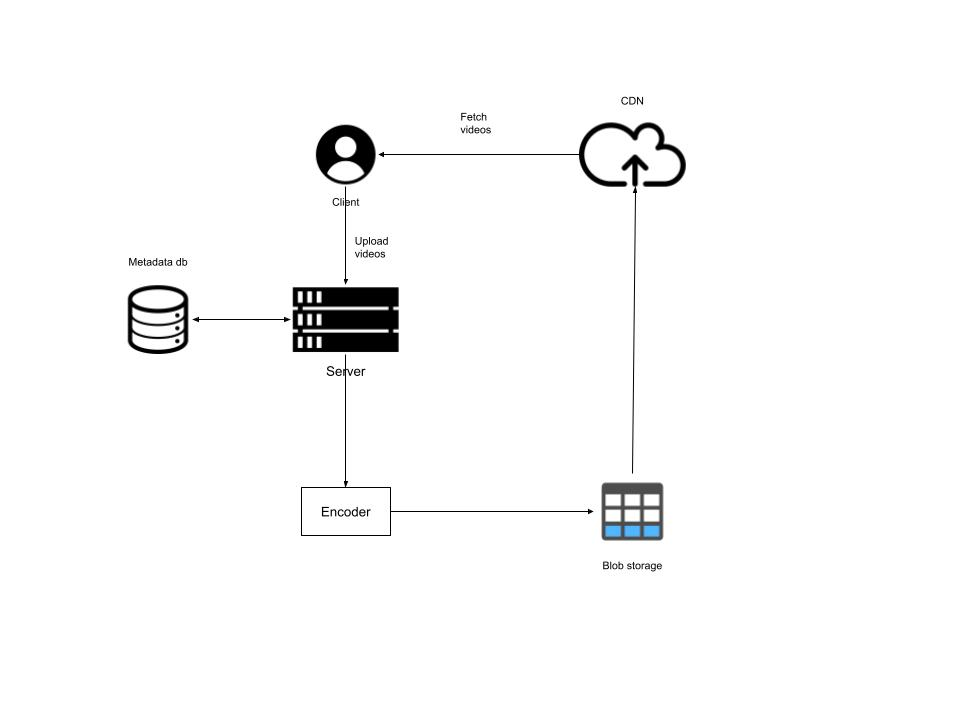

#### Functional Requirements
- Stream/upload videos
- Search videos
- Like/dislike videos
- Add comments
- View thumbnails

#### Non-functional Requirements
- high availability
- scalability
- good performance
- reliability

#### Resource estimation
- storage: based on number of videos uploaded and the average size of a video
- bandwidth: based on number of videos uploaded and streamed, and the size of each video
  - 1 byte = 8 bits
  - bandwidth is normally measured in bits/seconds

#### High Level Design

1. Client upload the video to server
2. Metadata about the video is stored onto the db
3. Server then passing the video to encoder
4. After encoding, the video is stored in blob storage
5. Some popular videos will be sent over to CDN
6. Client can fetch videos from the CDN

#### API Design: REST
- Upload video
  - POST method
  - uploadVideo(user_id, video_file, category_id, title, description, tags, default_language, privacy_settings)
- Stream video
  - GET method
  - streamVideo(user_id, video_id, screen_resolution, user_bitrate, device_chipset)
- Search video
  - GET method
  - searchVideo(user_id, search_string, length, quality, upload_date)
- View thumbnail
  - GET method
  - viewThumbnail(user_id, video_id)
- Like/dislike
  - POST method
  - likeDislike(user_id, video_id, like)
- Comment
  - POST method
  - commentVideo(user_id, video_id, comment_text)

#### Storage schema

#### Detailed design
- Load balancer
- Web server: acting like a front end API server to respond to user requests
- Application server: business logic
- User and video metadata storage: a cluster of it with sharding and replication as well
  - MySQL for limited number of concurrent reads and writes
  - NoSQL when the number of concurrent reads and writes—grows
- Bigtable: for thumbnails
- Upload storage: temporary storage
- Encoder
- CDN and colocation sites

